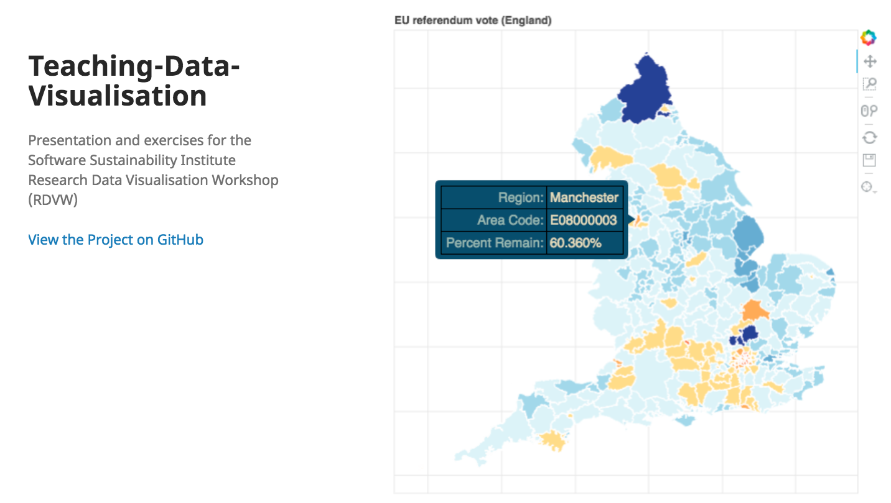
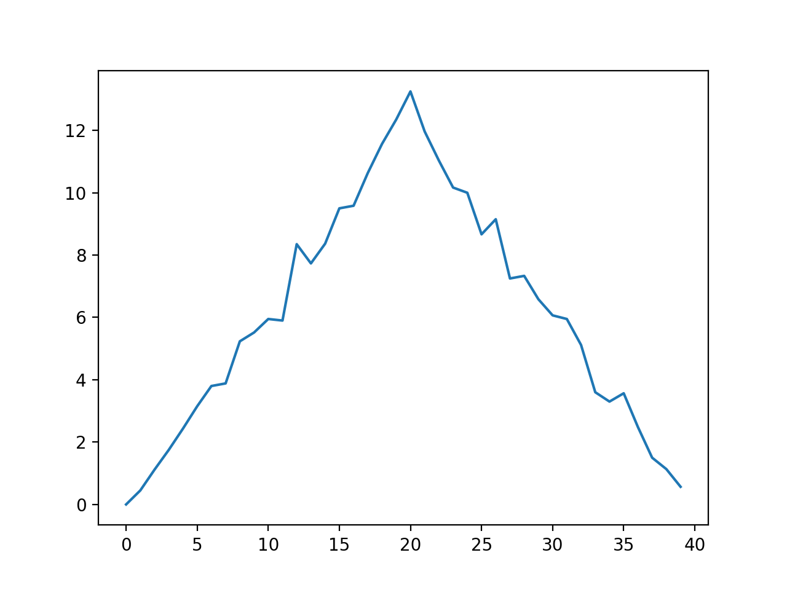

```{r setup, include=FALSE}
knitr::opts_chunk$set(echo = TRUE)
```

## Etherpad

Please do use the course Etherpad:

- [http://pad.software-carpentry.org/2018-03-29-standrews](http://pad.software-carpentry.org/2018-03-29-standrews)

<div class="highlight">
- **Communal notes**: share your understanding, and benefit from others
- **Ask questions**: get detailed answers with links and examples
- **A record/reference for after the course**
</div>


## Why Are We Here?

- **To learn basic concepts of programming** (in Python)

<div class="attention">
- **How to solve problems in your research by…**
  - Building functions
  - Automating tasks
</div>
  
<div class="highlight">
- **Mechanics of manipulating data**
  - File I/O
  - Data structures
</div>


## XKCD

<center>

</center>

## How Are We Doing This?

<div class="highlight">
**Using the `Python` language**
</div>

- we need *something* ;)
- free, well-documented, and cross-platform
- large academic userbase
- many *libraries* for specialist work


<div class="attention">
**we won't be covering the entire language**
</div>


## No, I mean "*how* are we doing this?"

<div class="attention">
**Text editor**

- the more usual way to write code
- edit-save-execute cycle
</div>

<div class="highlight">
**`Jupyter` notebook**

- interactive notebook-based interface
- good for data exploration, prototyping, and teaching
- not so good for writing scripts/'production code'
</div>


## Do I need to use `Python` afterwards?

- No. ;)
  - The lesson is general, it's just taught in `Python`
  - The principles are the same in nearly all languages
  - If your colleagues/field settled on another language(s), maybe learn that
  - (language wars are unproductive… ;) )


## What are we doing?

<div class="highlight">
**Analysing and visualising experimental data**

- Effectiveness of a new treatment for arthritis
- Several patients, recording inflammation on each day
- Tabular (comma-separated) data
</div>

<div class="attention">
**We're going to get the computer to do this for us**

- Why not just do it by hand?
- **AUTOMATION**, **REUSE**, **SHARING**
</div>


# 01. Setup

## Setting Up - 1

Before we begin… 

- **make a neat working environment in the terminal**
- obtain data

```bash
cd ~/Desktop
mkdir python-novice-inflammation
cd python-novice-inflammation
```

<div class="attention">
**LIVE DEMO**
</div>


## Setting up - 2

Before we begin… 

* make a neat working environment
* **obtain data**

```bash
cp 2018-03-29-standrews/lessons/python/files/python-novice-inflammation-data.zip ./
unzip python-novice-inflammation-data.zip
cp 2018-03-29-standrews/lessons/python/files/python-novice-inflammation-code.zip ./
unzip python-novice-inflammation-code.zip
```

(you can download files via [`Etherpad`](http://pad.software-carpentry.org/2018-03-29-standrews): [http://pad.software-carpentry.org/2018-03-29-standrews](http://pad.software-carpentry.org/2018-03-29-standrews))

<div class="attention">
**LIVE DEMO**
</div>

<center>

</center>


# 02. Getting Started

## `Python` in the terminal

<div class="highlight">
We start the `Python` console by executing the command `python`
</div>

```bash
$ python
Python 3.6.3 |Anaconda custom (64-bit)| (default, Oct  6 2017, 12:04:38) 
[GCC 4.2.1 Compatible Clang 4.0.1 (tags/RELEASE_401/final)] on darwin
Type "help", "copyright", "credits" or "license" for more information.
>>> 
```

<div class="attention">
**LIVE DEMO**
</div>

<center>

</center>


## `Python` REPL

- `Python`'s **console** is a *read-evaluate-print-loop*, just like the shell

```python
>>> 3 + 5
8
>>> 12 / 7
1.7142857142857142
>>> 2 ** 16
65536
>>> 15 % 4
3
>>> (2 + 4) * (3 - 7)
-24
```

<div class="attention">
**LIVE DEMO**
</div>

<center>

</center>


## My first variable

- To do interesting things, we want *persistent* values

<div class="highlight">
- variables are like *named boxes*
- data goes in the box
- when we use the name of the box, we mean **what's in the box**
</div>

<center>

</center>

## Creating a variable

<div class="attention">
- To *assign* a value use the *equals sign*: `=`
- The variable name/box label goes on the left, and the data item goes on the right
- *Character strings*, or just *strings*, are enclosed in quotes
</div>

```python
>>> name = "Samia"
>>> name
'Samia'
>>> print(name)
Samia
```

<div class="attention">
**LIVE DEMO**
</div>

<center>

</center>


## Working with variables

```python
weight_kg = 55
print(weight_kg)
2.2 * weight_kg
print("weight in pounds", 2.2 * weight_kg)
weight_kg = 57.5
print("weight in kilograms is now:", weight_kg)
weight_lb = 2.2 * weight_kg
print('weight in kilograms:', weight_kg, 'and in pounds:', weight_lb)
weight_kg = 100
print('weight in kilograms:', weight_kg, 'and in pounds:', weight_lb)
```

<div class="attention">
**LIVE DEMO**
</div>

<center>

</center>


##  Exercise 01 (5min)

<div class="highlight">
What are the values in `mass` and `age` after the following code is executed?
</div>

```python
mass = 47.5
age = 122
mass = mass * 2.0
age = age - 20
```

1. `mass == 47.5`, `age == 122`
2. `mass == 95.0`, `age == 102`
3. `mass == 47.5`, `age == 102`
4. `mass == 95.0`, `age == 122`


##  Exercise 02 (5min)

<div class="highlight">
What does the following code print out?
</div>

```python
first, second = 'Grace', 'Hopper'
third, fourth = second, first
print(third, fourth)
```

1. `Hopper Grace`
2. `Grace Hopper`
3. `"Grace Hopper"`
4. `"Hopper Grace"`


# 03. Data Analysis

## Examine the data

- Inspect a data file using the shell

```bash
$ head data/inflammation-01.csv 
0,0,1,3,1,2,4,7,8,3,3,3,10,5,7,4,7,7,12,18,6,13,11,11,7,7,4,6,8,8,4,4,5,7,3,4,2,3,0,0
0,1,2,1,2,1,3,2,2,6,10,11,5,9,4,4,7,16,8,6,18,4,12,5,12,7,11,5,11,3,3,5,4,4,5,5,1,1,0,1
0,1,1,3,3,2,6,2,5,9,5,7,4,5,4,15,5,11,9,10,19,14,12,17,7,12,11,7,4,2,10,5,4,2,2,3,2,2,1,1
0,0,2,0,4,2,2,1,6,7,10,7,9,13,8,8,15,10,10,7,17,4,4,7,6,15,6,4,9,11,3,5,6,3,3,4,2,3,2,1
0,1,1,3,3,1,3,5,2,4,4,7,6,5,3,10,8,10,6,17,9,14,9,7,13,9,12,6,7,7,9,6,3,2,2,4,2,0,1,1
0,0,1,2,2,4,2,1,6,4,7,6,6,9,9,15,4,16,18,12,12,5,18,9,5,3,10,3,12,7,8,4,7,3,5,4,4,3,2,1
0,0,2,2,4,2,2,5,5,8,6,5,11,9,4,13,5,12,10,6,9,17,15,8,9,3,13,7,8,2,8,8,4,2,3,5,4,1,1,1
0,0,1,2,3,1,2,3,5,3,7,8,8,5,10,9,15,11,18,19,20,8,5,13,15,10,6,10,6,7,4,9,3,5,2,5,3,2,2,1
0,0,0,3,1,5,6,5,5,8,2,4,11,12,10,11,9,10,17,11,6,16,12,6,8,14,6,13,10,11,4,6,4,7,6,3,2,1,0,0
0,1,1,2,1,3,5,3,5,8,6,8,12,5,13,6,13,8,16,8,18,15,16,14,12,7,3,8,9,11,2,5,4,5,1,4,1,2,0,0
```

<div class="highlight">
- To load this data in `Python`, we'll use the `numpy` *library*
</div>

<div class="attention">
**We want to produce summary information about inflammation by patient and by day**
</div>


## `Python` libraries

- `Python` contains many powerful, general tools
- Specialised tools are contained in *libraries* or *packages*
- We call on libraries/packages, when needed
- Packages are loaded with `import`
- Packages are shared via repositories, e.g. [`PyPI`](https://pypi.python.org/pypi) and [`conda`](https://conda.io/docs/)

```python
>>> import numpy
```

<div class="attention">
**LIVE DEMO**
</div>

<center>

</center>


## Load data from file

- `numpy` provides a function `loadtxt()` to load tabular data:

```python
numpy.loadtxt(fname='data/inflammation-01.csv', delimiter=',')
```

<div class="highlight">
- *dotted notation* tells us `loadtxt()` belongs to `numpy`
- `fname`: an *argument* expecting the path to a file
- `delimiter`: an *argument* expecting the character that separates columns
</div>


## Loaded data

```python
>>> numpy.loadtxt(fname='data/inflammation-01.csv', delimiter=',')
array([[ 0.,  0.,  1., ...,  3.,  0.,  0.],
       [ 0.,  1.,  2., ...,  1.,  0.,  1.],
       [ 0.,  1.,  1., ...,  2.,  1.,  1.],
       ..., 
       [ 0.,  1.,  1., ...,  1.,  1.,  1.],
       [ 0.,  0.,  0., ...,  0.,  2.,  0.],
       [ 0.,  0.,  1., ...,  1.,  1.,  0.]])
```

- The matrix is truncated to fit the screen
- `...` indicate missing rows or columns
- If there are no significant digits, they are not shown (`1 == 1. == 1.0`)

<div class="highlight">
**Assign the matrix to a variable called `data`**
</div>

<div class="attention">
**LIVE DEMO**
</div>


## What is our data?

```python
>>> type(data)
<class 'numpy.ndarray'>
```

<div class="attention">
**LIVE DEMO**
</div>

<center>

</center>


## Members and attributes

- Creating the array created information, too
- Info stored in *members* or *attributes* that belong to `data`
- `data.<attribute>` e.g. `data.shape`

```python
>>> print(data.dtype)
float64
>>> print(data.shape)
(60, 40)
```

<div class="attention">
**LIVE DEMO**
</div>

<center>

</center>


## Indexing arrays

- We often work with subsets of data
  - individual rows (patients)
  - individual columns (days)

<div class="attention">
- Counting of array elements **starts at zero**, not at one.
</div>

```python
>>> print('first value in data:', data[0, 0])
first value in data: 0.0
>>> print('middle value in data:', data[30, 20])
middle value in data: 13.0
```

<center>

</center>

<div class="attention">
**LIVE DEMO**
</div>


## Slicing arrays

- To get a *range* of data from the array, index with `[` and specify *start* and *end* indices

<div class="attention">
- `0:4` means **start at zero** and go up to **but not including** 4
  - `0, 1, 2, 3`
</div>

<div class="highlight">
- Define *start* and *end* separated by `:` (colon).
</div>

```python
>>> print(data[0:4, 0:10])
[[ 0.  0.  1.  3.  1.  2.  4.  7.  8.  3.]
 [ 0.  1.  2.  1.  2.  1.  3.  2.  2.  6.]
 [ 0.  1.  1.  3.  3.  2.  6.  2.  5.  9.]
 [ 0.  0.  2.  0.  4.  2.  2.  1.  6.  7.]]
```

<div class="attention">
**LIVE DEMO**
</div>

<center>

</center>


## More slices, please!

<div class="highlight">
- Don't specify *start*, `Python` assumes the first element
- Don't specify *end*, `Python` assumes the end element
</div>

```python
>>> small = data[:3, 36:]
>>> print('small is:\n', small)
```

<div class="attention">
**QUESTION:** What would `:` on its own indicate?
</div>

<div class="attention">
**LIVE DEMO**
</div>

<center>

</center>


##  Exercise 03 (5min)

We can take slices of any series, not just arrays.

```python
>>> element = 'oxygen'
>>> print('first three characters:', element[0:3])
first three characters: oxy
```

What is the value of `element[:4]`?

1. `oxyg`
2. `gen`
3. `oxy`
4. `en`

## Array operations

- `array`s know how to perform operations on their values
- `+`, `-`, `*`, `/`, etc. are *elementwise*

```python
>>> doubledata = data * 2.0
>>> print("original:\n", data[:3, 36:])
original:
 [[ 2.  3.  0.  0.]
 [ 1.  1.  0.  1.]
 [ 2.  2.  1.  1.]]
>>> print("doubledata:\n", doubledata[:3, 36:])
doubledata:
 [[ 4.  6.  0.  0.]
 [ 2.  2.  0.  2.]
 [ 4.  4.  2.  2.]]
```

<div class="attention">
**LIVE DEMO**
</div>


## `numpy` functions

- `numpy` provides functions to operate on arrays

```python
>>> print(numpy.mean(data))
6.14875
>>> print(data.mean())
6.14875
>>> maxval = numpy.max(data)
>>> print('maximum inflammation:', maxval)
maximum inflammation: 20.0
>>> minval = data.min()
>>> print('minimum inflammation:', minval)
minimum inflammation: 0.0
```

<div class="highlight">
- By default, these give summaries of the whole array.
</div>

<div class="attention">
**LIVE DEMO**
</div>


## Summary for one patient

- We want to summarise inflammation *by patient*

<div class="highlight">
Extract a single row, or operate directly on a row
</div>

```python
>>> patient_0 = data[0, :] # temporary variable
>>> print('maximum inflammation for patient 0:', patient_0.max())
maximum inflammation for patient 0: 18.0
>>> print('maximum inflammation for patient 0:', numpy.max(data[0, :]))
maximum inflammation for patient 0: 18.0
>>> print('maximum inflammation for patient 2:', numpy.max(data[2, :]))
maximum inflammation for patient 2: 19.0
```

<div class="attention">
**LIVE DEMO**
</div>


## Summary for all patients

- What if we need maximum inflammation for *each patient* or average inflammation on *each day*?
- One line per patient/per day?

<div class="attention">
**Tedious. Prone to errors/typos**: easier way to to do this…
</div>

<center>

</center>


## `numpy` operations on axes

- `numpy` functions take an `axis=` parameter: `0` (columns) or `1` (rows)

```python
>>> print(numpy.max(data, axis=1))    # max by patient
[ 18.  18.  19.  17.  17.  18.  17.  20.  17.  18.  18.  18.  17.  16.  17.
  18.  19.  19.  17.  19.  19.  16.  17.  15.  17.  17.  18.  17.  20.  17.
  16.  19.  15.  15.  19.  17.  16.  17.  19.  16.  18.  19.  16.  19.  18.
  16.  19.  15.  16.  18.  14.  20.  17.  15.  17.  16.  17.  19.  18.  18.]
>>> print(data.mean(axis=0))          # mean by day
[  0.           0.45         1.11666667   1.75         2.43333333   3.15
   3.8          3.88333333   5.23333333   5.51666667   5.95         5.9
   8.35         7.73333333   8.36666667   9.5          9.58333333
  10.63333333  11.56666667  12.35        13.25        11.96666667
  11.03333333  10.16666667  10.           8.66666667   9.15         7.25
   7.33333333   6.58333333   6.06666667   5.95         5.11666667   3.6
   3.3          3.56666667   2.48333333   1.5          1.13333333
   0.56666667]
```

<div class="attention">
**LIVE DEMO**
</div>


# 04. Visualisation

## Visualisation

> "The purpose of computing is insight, not numbers" - Richard Hamming

<div class="highlight">
The best way to gain insight is often to visualise data
</div>

- Visualisation deserves a course to itself
- Here's one I prepared earlier (for the [Software Sustainability Institute](https://www.software.ac.uk/)):

<center>

</center>

- [Research Data Visualisation Workshop](https://widdowquinn.github.io/Teaching-Data-Visualisation/)


## Graphics package: `matplotlib`

<div class="highlight">
`matplotlib` is the *de facto* standard/base plotting library in `Python`
</div>

```python
>>> import matplotlib.pyplot
```

<div class="attention">
**LIVE DEMO**
</div>

<center>

</center>


## `matplotlib.pyplot.imshow()`

<div class="highlight">
`matplotlib.pyplot.imshow()` renders matrix values as an image
</div>

```python
>>> image = matplotlib.pyplot.imshow(data)
>>> matplotlib.pyplot.show()
```

- small values are dark blue, large values are yellow
- inflammation rises and falls over a 40-day period

<center>

</center>


## `matplotlib.pyplot.plot()`

- `matplotlib.pyplot.plot()` renders a line graph

<div class="highlight">
We want to plot the average inflammation level on each day
</div>

```python
>>> ave_inflammation = numpy.mean(data, axis=0)
>>> ave_plot = matplotlib.pyplot.plot(ave_inflammation)
>>> matplotlib.pyplot.show()
```

<center>

</center>

<div class="attention">
**QUESTION: does this look reasonable?**
</div>


## Investigating data

- The plot of `.mean()` looks artificial
- Look at other statistics to gain insight

```python
>>> max_plot = matplotlib.pyplot.plot(numpy.max(data, axis=0))
>>> matplotlib.pyplot.show()
>>> min_plot = matplotlib.pyplot.plot(numpy.min(data, axis=0))
>>> matplotlib.pyplot.show()
```

<div class="attention">
**QUESTION: does this look reasonable?**
</div>


##  Exercise 04 (5min)

<div class="highlight">
Can you create a plot showing the standard deviation (`numpy.std()`) of the inflammation data for each day across all patients?
</div>

<center>

</center>


## Figures and subplots

<div class="highlight">
We can put all three plots into a single *figure*
</div>

- create a *figure* (`fig`) with `fig = matplotlib.pyplot.figure()`
- add subplots to `fig` with `ax = fig.add_subplot()`
- set labels on a subplot with `ax.set_ylabel()`
- plot data to a subplot with `ax.plot()`

<div class="attention">
**LIVE DEMO**
</div>

<center>

</center>


##  Exercise 05 (5min)

<div class="highlight">
Can you modify your script to display the three graphs on top of one another, instead of side by side?
</div>

<div class="attention">
**Save your new script as `exercise_05.py`**
</div>

<center>

</center>


# 05. Loops

## Motivation

- We wrote some code that plots values of interest from a single dataset


- **BUT** we're soon going to receive *dozens* of datasets to plot
- So we need to make the computer *iterate* over the data

<div class="highlight">
**`for` loops**
</div>


## Spelling Bee

- Suppose we wanted to spell a word, one letter at a time

```python
word = "lead"
print(word[0])
print(word[1])
print(word[2])
print(word[3])
```

<div class="attention">
**QUESTION:** Why is this not a good approach?
</div>

<div class="attention">
**LIVE DEMO**
</div>


## `for` loops

- `for` loops perform actions *for* every item *in* a collection

```python
>>> word = "lead"
>>> for char in word:
...     print(char)
... 
l
e
a
d
```

<div class="attention">
**LIVE DEMO**
</div>


## `for` loop syntax

```python
for element in collection:
    <do things with element>
```

- The `for` loop statement ends in a colon, `:`
- The *code block* is **indented** with a `tab` (`\t`)

<center>

</center>


## Counting with a `for` loop

<div class="highlight">
Values defined outside a loop can be modified in the loop
</div>

```python
>>> length = 0
>>> for vowel in 'aeiou':
...     length = length + 1
... 
>>> print("There are", length, "vowels") 
```

<div class="attention">
**QUESTION:** What output does this program give you?
</div>

<div class="attention">
**LIVE DEMO**
</div>


## `for` loop variables

<div class="highlight">
- The *loop variable* is updated on each cycle
- It keeps its value when the loop is finished
</div>

```python
>>> letter = "z"
>>> print(letter)
z
>>> for letter in "abc":
...     print(letter)
... 
>>> print("after the loop, letter is:", letter)
```

<div class="attention">
**LIVE DEMO**
</div>


## `range()`

<div class="highlight">
`range()` is a `Python` function that creates a sequence of numbers
</div>

- It returns a `range` type that can be iterated over in a loop

```python
>>> seq = range(3)
>>> print("Range is:", seq)
>>> for val in seq:
...     print(val)
>>> seq = range(2, 5)
>>> seq = range(3, 10, 3)
>>> seq = range(10, 0, -1)
```

<div class="attention">
**LIVE DEMO**
</div>


##  Exercise 06 (5min)

<div class="highlight">
Can you write a loop that takes a string, e.g. `Newton`, and produces a new string with the characters in reverse order, e.g. `notweN`?
</div>

<div class="attention">
**HINTS**

1. You can "add" strings, e.g. `ab` + `cd`
2. An *empty string* can be created with `mystr = ""`
</div>

<center>

</center>


# 06. Lists


